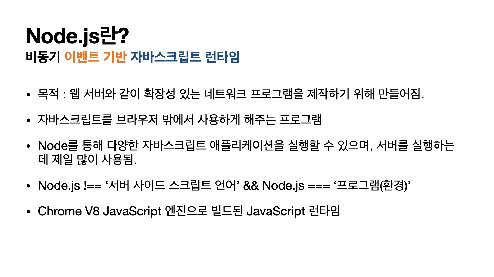
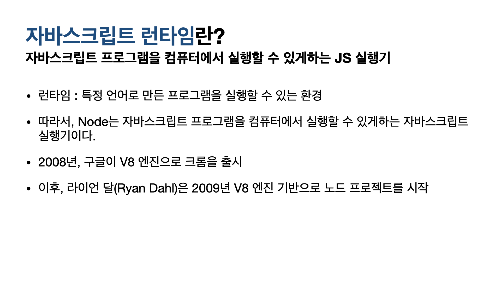
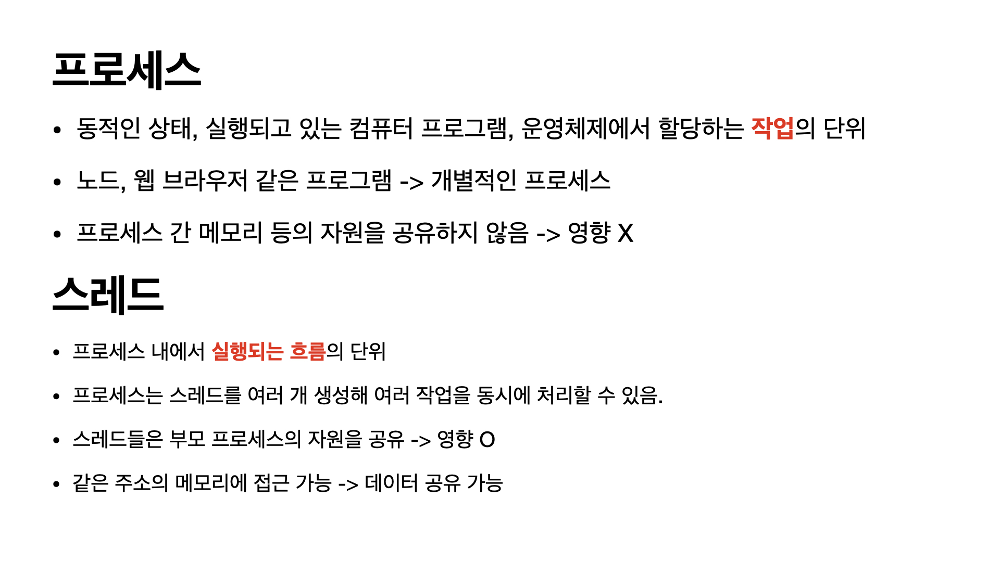
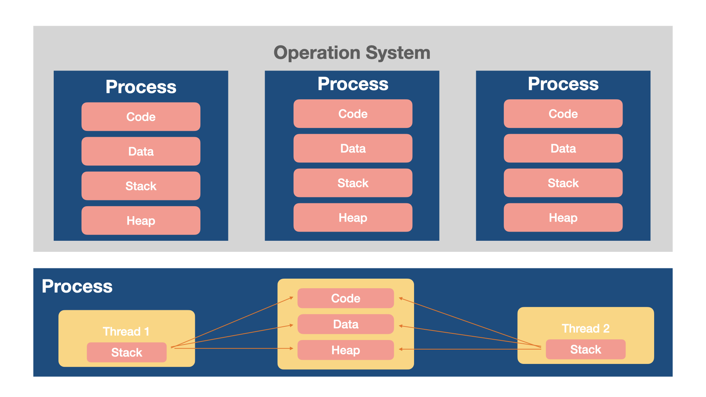
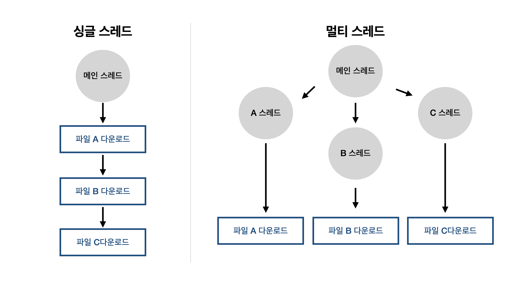
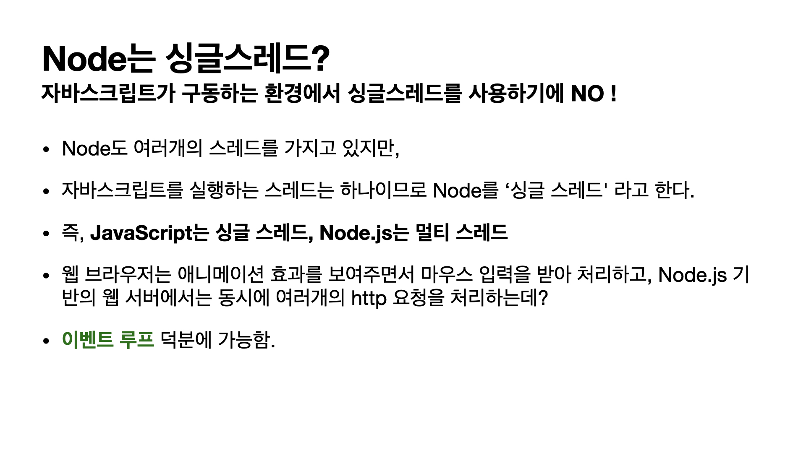
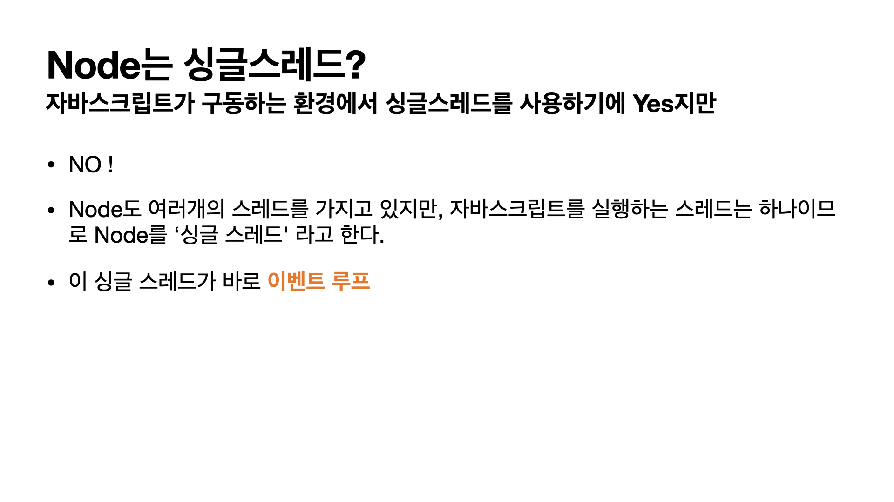
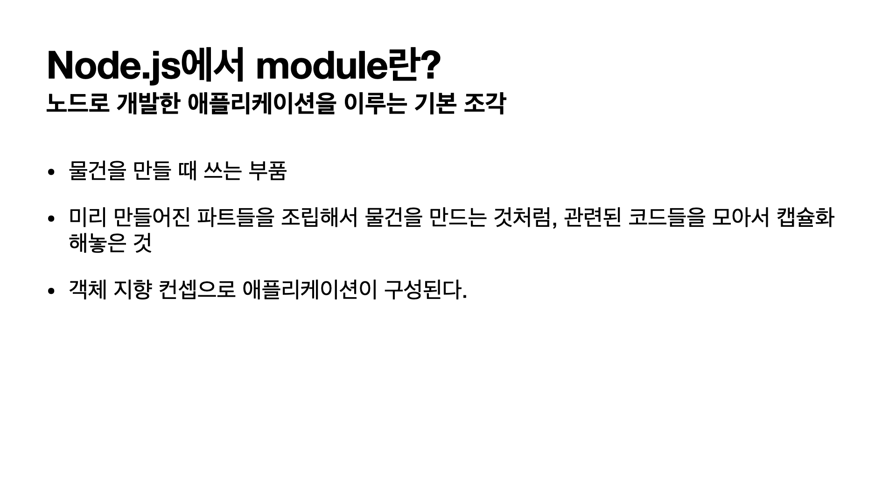
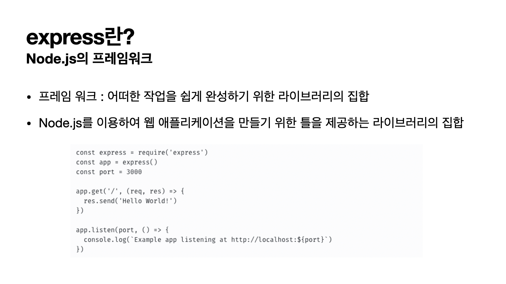

# Node.js에 관하여

Node에 대해 알아보자.

Node.js란, 비동기 이벤트 기반 자바스크립트 런타임이다. 웹 서버와 같은 확장성 있는 네트워크 프로그램을 제작하기 위해 만들어졌다. 즉, 자바스크립트를 브라우저 밖에서 사용하게 해주는 프로그램이라고 할 수 있다. 서버를 실행하는 데 제일 많이 사용이 된다.

예전부터 헷갈렸던 개념이다. Node.js는 서버 사이드의 스크립트 언어가 아니다. 프로그램 또는 환경이다.

Chrome V8 JS 엔진으로 빌드된 자바스크립트 런타임에 대해 조금 더 알아보자.

자바스크립트 런티임이란, JS 프로그램을 컴퓨터에서 실핼할 수 있게하는 JS 실행기이다. 여기서 런타임은 '특정 언어로 만들 프로그램을 실행할 수 있는 환경'을 뜻한다. 2008년, 구글이 V8ㄴ 엔진으로 크롬을 출시하고, 이후 라이언 달이 2009년 이를 기반으로 노드 프로젝트를 시작하였다.

그렇다면 이벤트 기반이란 무엇을까? 

이벤트가 발생할 때, 미리 지정해둔 작업을 수행하는 방식이라고 말할 수 있다. 특정 이벤트가 발생할 때, 무엇을 할지 미리 정해둔 작업을 수행하는 방식이다. 이후 이벤트가 발생하면 리스너에 등록해 둔 콜백함수를 호출하며, 이벤트가 끝난 후 노드는 다음 이벤트가 발생할 때까지 대기한다.

Node.js에서 말하는 이벤트 루프는 여러 이벤트가 동시에 발생했을 때 어떤 순서로 콜백함수를 호출할 지를 판단하는 것이다. 이벤트가 종료될 떄까지 이벤트 처리를 위한 작업을 반복하는 것을 '루프'라고 부른다.

Node.js는 싱글 스레드라고 한다.그 이유를 알기위해서는 몇 가지 알아야 할 개념들이 있다. 먼저, 프로그램이란 파일이 저장 장치에 저장되어 있지만, 메모리가 올라가있지 않은 정적인 상태를 뜻하는 말이다. 그럼처럼 프로그램이 실행되면 그제서야 이를 '프로세스'라고 부를 수 있다.

프로세스란, 동적인 상태를 말하며, 실행되고 있는 컴퓨터 프로그램, 운영체제에서 할당하는 작업의 단위를 말한다. 노드, 웹 브라우저 같은 프로그램이 개별적인 프로세스라고 할 수 있다. 이는 프로세스 간 메모리 등의 자원을 공유하지 않아 서로에게 영향을 끼치지 않는다.

스레드란, 조금 더 작은 단위로 프로세스 내에서 실행되는 흐름의 단위이다. 프로세스는 스레드를 여러 개 생성해 여러 작업을 동시에 처리할 수 있다. 스레드들은 부모 프로세스의 자원을 공유하여 영향을 받아 데이터 공유가 가능하가.

그림으로 살펴보자면, 운영체제에서 각각 나눠져있는 프로세스를 볼 수 있고, 각 프로세스는 code, data, stack, heap의 형태로 관리된다. 프로세스들간의 공유를 이루어지지 않는다.

반면 프로세스(아래 그림)는 각 스레드가 자원을 공유하고 있는 것을 볼 수 있다.

스레드는 싱글 스레드와 멀티 스레드로 나뉜다. 싱글 스레드는 직렬을 형태로 하나의 스레드가 하나의 작업만 수행하여 순서대로 처리하는 모습을 볼 수 있다. 멀티 스레드는 병렬로 일을 처리하며 여러가지 스레드를 한꺼번에 처리한다.

이 둘의 가장 큰 차이점은 싱글 스레드는 동기화에 신경을 쓰지 않아도지만, 멀티 스레드는 자원을 공유하기 때문에 동기화 문제가 일어난다.

다시 본론으로 돌아와서 Node는 싱글 스레드일까?

자바스크립트가 구동하는 환경에서 싱글 스레드를 사용하기에 맞다고 할 수 있지만, 아니다. 노드도 여러개의 스레드를 가지고 있지만, JS를 실행하는 스레드는 하나이므로 노드를 싱글 스레드라고 한다. 이 싱글 스레드가 앞서 설명했던 `이벤트 루프`이다.

노드에서 모듈이란, 노드로 개발한 애플리케이션을 이루는 기본조각이다. 쉽게 말해, 물건을 만들 때 쓰는 부품이라고 할 수 있으며, 리미 만들어진 파트들을 조립해서 물건을 만드는 것처럼 관련된 코드들을 모아서 캡슐화 해놓은 것을 말한다. 또한, 객체 지향 컴셈으로 앱이 구성된다.

그럼 객체 지향 프로그래밍이 뭘까? 프로그래밍에서 필요한 데이터를 추상화시켜 상태와 행위를 가진 객체를 만들고, 그 객체들 간의 유기적인 상호작용을 통해 로직을 구성하는 프로그래밍 방법이다. 

장점은 코드 재사용 용이하고, 유지보수 쉬우며, 대형 프로젝트에 적합하다. 단점은 처리 속도가 상대적으로 느리고, 객체 많으면 용량 커질 수 있고 설계시 많은 노력과 시간이 필요하다. 

더 공부하면 좋을 키워드는 다음과 같다.

- 키워드 : 클래스 + 인스턴스(객체), 추상화, 캡슐화, 상속, 다형성

마지막으로 express란, Node.js의 프레임 워크이다. 프레임 워크란 어떠한 작업을 쉽게 완성하기 위한 라이브러리의 집합니다. Node.js를 이용하여 웹 애플리케이션을 만들기 위한 틀을 제공하는 라이브러리의 집합이라고 할 수 있다.

