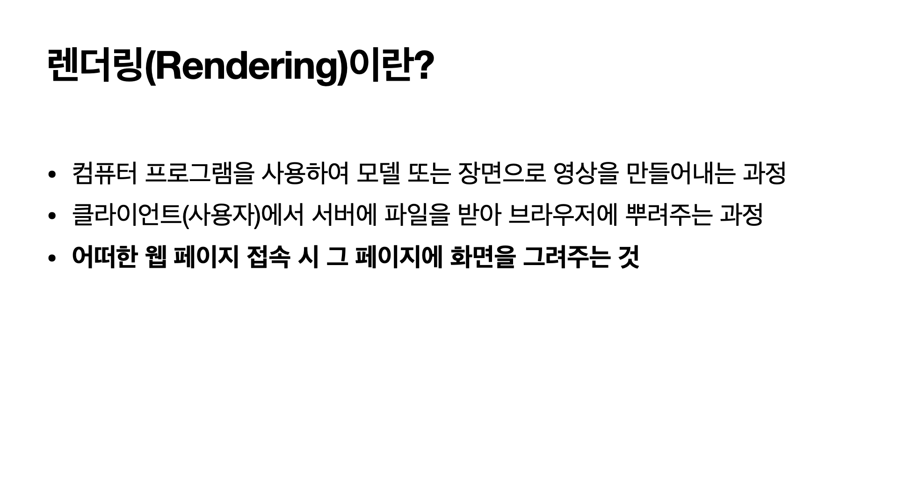
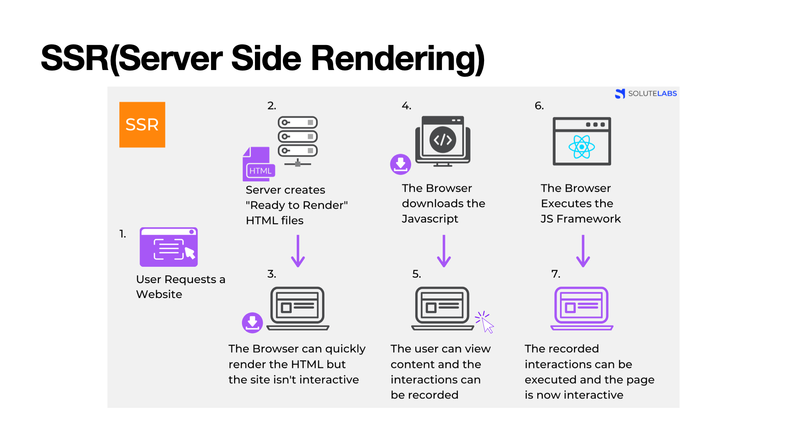
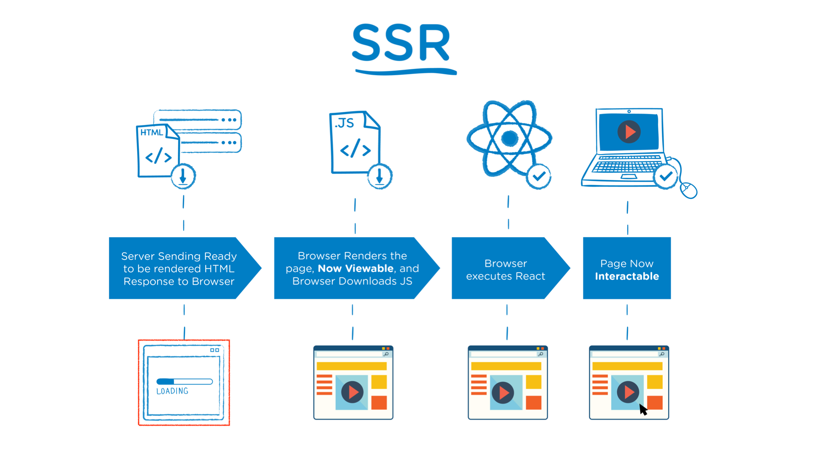
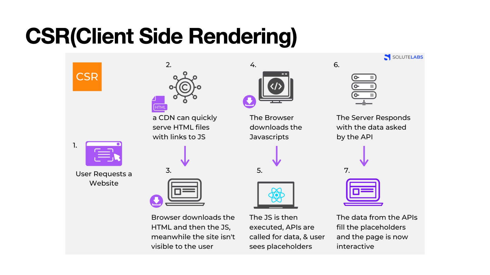
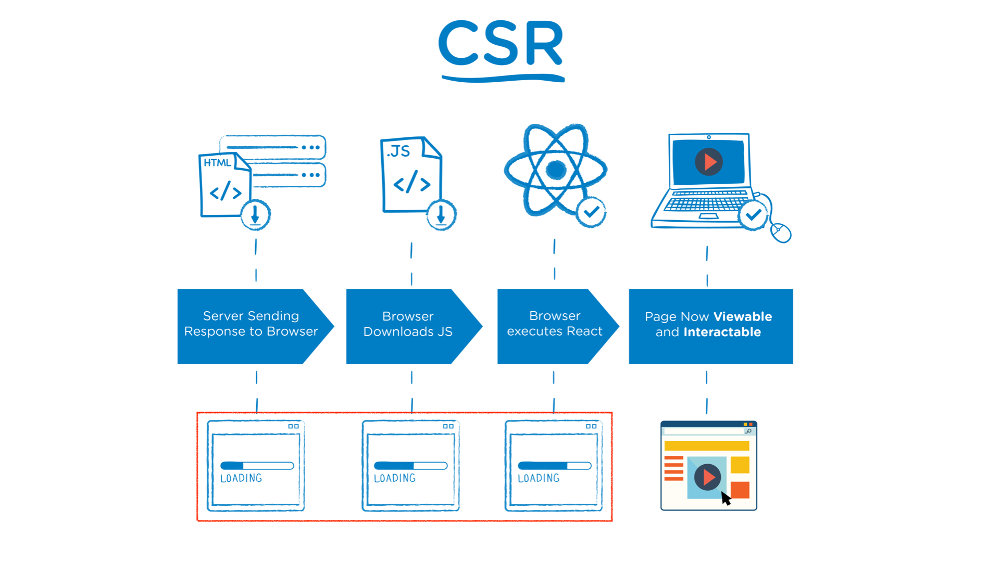
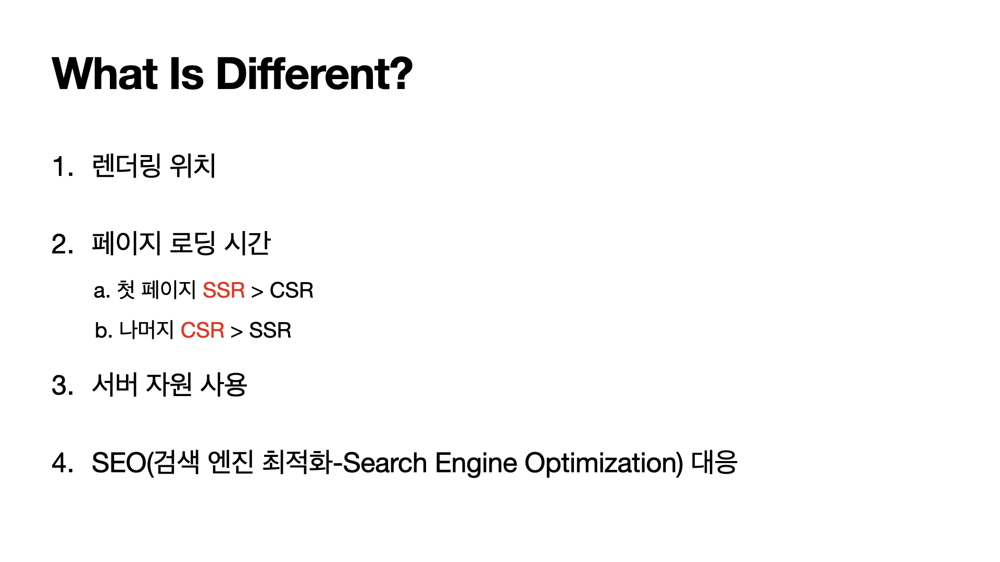
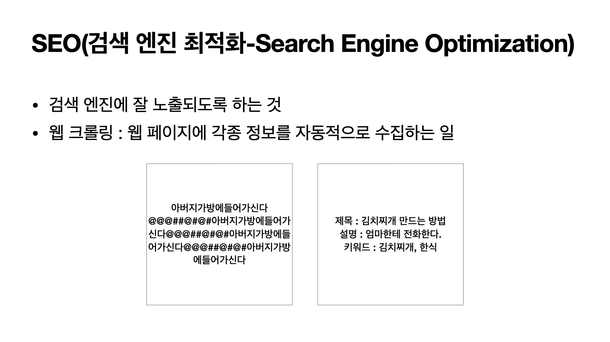
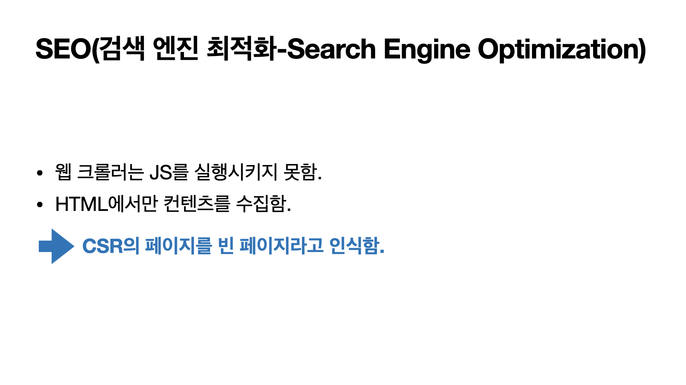
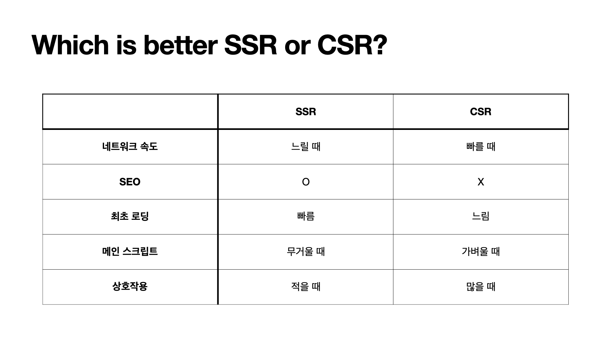
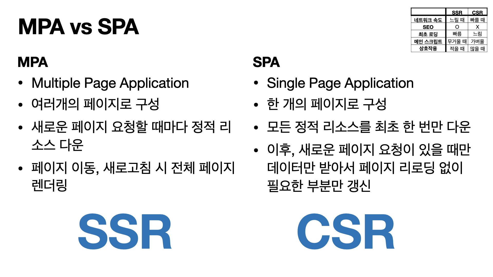

# SSR vs CSR

먼저, 렌더링이랑 무엇일까? 

정의 자체는 '컴퓨터 프로그램을 사용하여 모델 또는 장면으로 영상을 만들어내는 과정'을 말한다.
프론트엔드 개발자 입장에서 조금 더 쉽게 이해한다면, 어떠한 웹 페이지 접속 시 그 페이지를 화면에 그려주는 것이라고 할 수 있다.

## SSR

SSR은 Server-Side-Rendering을 약자이다. 
웹 어플리케이션이 렌더링 될 때, 브라우저 대신 서버에서 뿌려주는 과정이 실행된다. 즉 client-side에 페이지가 띄워지면, 렌더링 준비를 끝난 상태가 되는 것이다.

그 과정을 살펴본다면 다음과 같다.
1. 유저가 웹 사이트를 요청한다.
2. 서버에서 즉시 렌더링 가능한 HTML파일 만든다.
3. 브라우저는 HTML 렌더링 준비가 되어 즉시 렌더링이 가능하다. 하지만 조작은 불가능하다.
4. 브라우저 자바스크립트 다운로드한다. 
5. 그 사이 유저는 컨텐츠는 볼 수 있다. 또한, 그때의 조작을 기억하고 있다. 
6. 브라우저가 자바스크립트 프레임워크를 실행한다. 
7. 기록되어있던 조작이 실행되고, 웹 페이지 상호작용이 가능해진다.

조금 더 간단하게 살펴본다면, 서버에서 이미 렌더 가능한 상태로 클라이언트에 전달되기 때문에 JS 파일이 다운되는 동안 사용자는 웹 페이지 뷰를 볼 수 있다. 

이처럼 진행된다면 클라이언트는 매번 다른 루트를 사용하게 되고, 서버는 계속 일을 하게 된다.

## CSR

반대로 CSR는 Client Side Rendering의 약자이다. 클라이언트에서 렌더링이 일어난다는 뜻이다. 서버는 요청을 받으면 클라이언트에 HTML과 JS 파일을 보내주고, 클라이언트는 그것을 받아 렌더링을 과정을 실행한다.

과정은 다음과 같다.
1. 유저가 요청을 보낸다.
2. HTML과 JS로 접근할 수 있는 링크를 클라이언트쪽으로 보낸다.
3. 브라우저는 그 파일들은 다운받고, 그 동안 유저는 아무것도 볼 수 없다. (여기서 차이점을 보임)
4. 브라우저가 JS까지 다운로드가 되면, API가 불러온다.
5. 서버가 응답을 보내주면 페이지가 렌더링된다.

* CND(Content delivery network):물리적으로 가까운 서버에서 요청에 응답하는 방식

간단히 살펴보자면 서버에서 처리 없이 파일만 보내주기 때문에 HTML부터 JS까지 모두 다운로드 되고 실행되어야지 사용자가 볼 수 있는 페이지가 렌더링 된다.

서버는 다시 페이지를 보내주지 않으며, 클라이언트 요청이기 떄문에 루트에 따라 리렌더링합니다. 그러므로 사용했던 페이지는 첫번째 요청한 것과 같은 페이지를 유지하게 됩니다.

## 차이점

그렇다면 이 둘의 차이점은 어떤 것이 있을까?

- 첫번째, 렌더링 위치가 다르다. 말 그대로 직관적으로 봤을 때도 서버 사이드, 클라이언트 사이드로 위치적으로 차이가 있다.
- 두번째, 페이지 로딩시간에서 차이점을 보인다. 
페이지 로딩 시간을 2가지로 나누어 차이를 보았다. 먼저, 첫 페이지가 로딩되는 시간은 HTML문서를 먼저 보내주어 JS다운 동안 사용자에서 보일 수 있게 해주는 `SSR`이 비교적 빠르다. 
하지만, 나머지 로딩시간을 생각한다면 첫 렌더링 시 이미 페이지의 코드를 실행시켰기 때문에 `CSR`이 비교적 빠르다.  
SSR은 첫 페이지를 로딩한 과정을 정확하게 다시 실행하기 때문에 더 느리다.
- 세번째, SSR이 서버 자원을 더 많이 사용하여 매번 서버에 요청하기 때문에 서버 부하가 많다. 반면 CSR은 클라이언트에 요구되는 사항이 더 많기 때문에 서버 부하가 적다.
- 마지막 SEO 대응에서 차이를 보인다.

SEO는 검색 엔진 최적화로,검색 엔진의 근간이 되는 웹 크롤링은 웹 페이지에 각종 정보를 자동적으로 수집하는 것을 말한다.

첫번째 네모칸처럼 정제되지 않은 상태에서 글을 올려놓으면 검색이 잘 안될 것이다. 두번째처럼 잘 정제된 글이라면, 웹 사이트를 만든 사람의 의도대로 검색이 될 가능성이 높아진다.

그럼 웹 크롤러가 해당 정보를 읽을 수 있느냐가 중요한 포인트이다.

대부분의 웹 크롤러 봇들은 JS를 실행시키지 못하고. HTML에서만 컨텐츠를 수집한다. 따라서, CSR 방식으로 개발된 페이지를 빈 페이지라고 인식한다.

SSR 방식은 뷰를 서버에서 전부 렌더링하기 때문엔 HTML에 모든 컨텐츠가 저장되어 SEO를 사용하는데 문제가 없다.

어떤 상황에 SSR을 사용해야하고, CSR을 사용해야할까?

어떤 것이 더 좋다고 말할 순 없지만, 적절한 상황에 섞어 활용하는 것이 가장 중요하다.

대표적인 예로 MPA와 SPA가 있다.

MPA는 Multiple Page Application이라고 불리며, 여러개의 페이지로 구성된다. 새로운 페이지 요청할 때마다 정적 리소스 다운로드하기 떄문에 페이지 이동, 새로고침 시 전체 페이지 렌더링된다. SSR 방식이라고 할 수 있다.

SPA는 Single Page Application로, 한 개의 페이지로 구성되어 있다. 모든 정적 리소스를 최초 한 번만 다운로드한다.이후, 새로운 페이지 요청이 있을 때만 데이터만 받아서 페이지 리로딩 없이 필요한 부분만 갱신하게 된다. CSR 방식이라고 할 수 있다.

React, Vue와 같은 프레임워크로 SPA가 많이 쓰인다. SPA의 단점을 보완하고자 
React에서는 Next.js 프레임워크, Vue에서는 SSR을 지원하는 Nuxt.js 프레임워크로 SPA 에서도 SSR 방식을 사용할 수 있는 방법이 있다.

[Next.js 공식문서](https://nextjs.org/docs/getting-started)

---

Ref.
- https://dev.to/alain2020/ssr-vs-csr-2617 
- https://velog.io/@vagabondms/%EA%B8%B0%EC%88%A0-%EC%8A%A4%ED%84%B0%EB%94%94-SSR%EA%B3%BC-CSR%EC%9D%98-%EC%B0%A8%EC%9D%B4
https://velog.io/@midsummer/SSR-CSR-SEO
- https://ivorycode.tistory.com/entry/SSRSever-Side-Rendering%EA%B3%BC-CSRClient-Side-Rendering
- https://youtu.be/i4r1fUeLJcw (SEO 7분)
- https://hanamon.kr/spa-mpa-ssr-csr-%EC%9E%A5%EB%8B%A8%EC%A0%90-%EB%9C%BB%EC%A0%95%EB%A6%AC/

